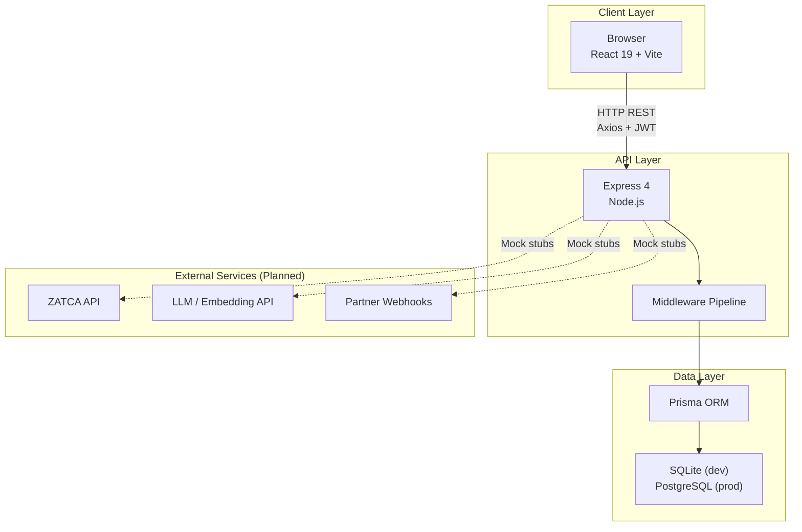
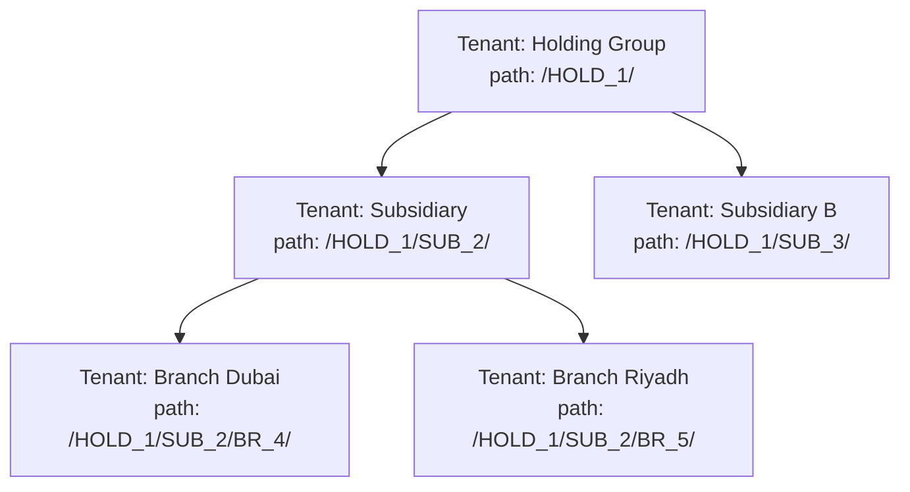
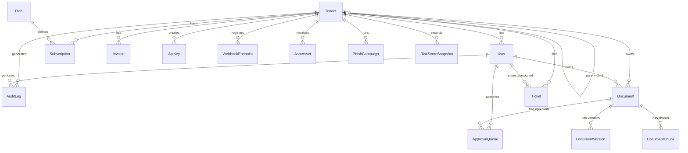
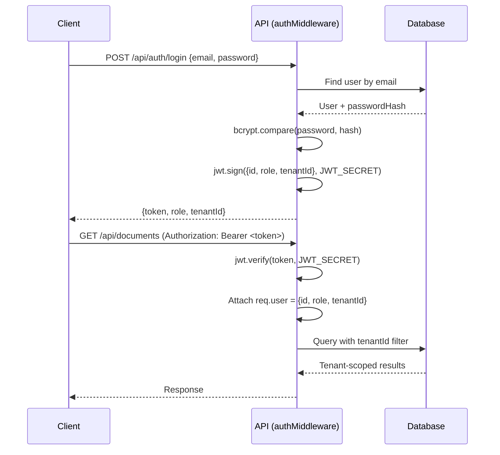
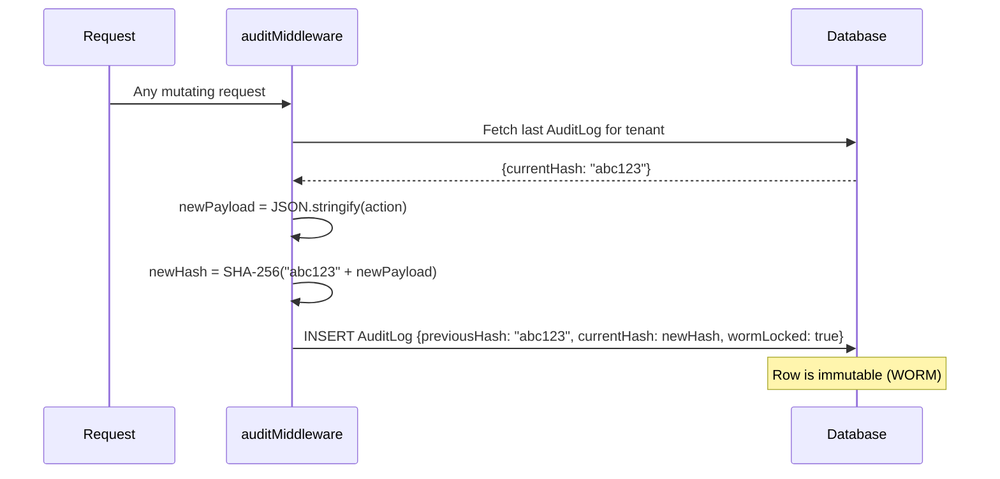

# GRC Wisdom — Architecture (`architecture.md`)

> **Generated**: 2026-07-27 — verified against every source file.

---

## 1. High-Level Architecture



## 2. Frontend Architecture

```
┌─────────────────────────────────────────────────────┐
│                    React Application                 │
│                                                      │
│  ┌─────────────────┐  ┌──────────────────────────┐  │
│  │   AuthProvider   │  │     BrowserRouter         │  │
│  │  (Context API)   │  │                           │  │
│  │  ┌────────────┐  │  │  /          → PortalDir   │  │
│  │  │token       │  │  │  /login/:id → PortalLogin │  │
│  │  │role        │  │  │  /app/*     → AppShell    │  │
│  │  │tenantId    │  │  │  *          → Redirect /  │  │
│  │  └────────────┘  │  └──────────────────────────┘  │
│  └─────────────────┘                                 │
│                                                      │
│  ┌──────────────────────────────────────────────────┐│
│  │              AppShell (Main Dashboard)            ││
│  │  ┌──────────┐ ┌──────────────────────────────┐   ││
│  │  │ Sidebar  │ │ Content Area                  │   ││
│  │  │ (per-    │ │ renderMockView(page, account) │   ││
│  │  │  portal  │ │     ↓                         │   ││
│  │  │  nav)    │ │ dangerouslySetInnerHTML        │   ││
│  │  └──────────┘ └──────────────────────────────┘   ││
│  └──────────────────────────────────────────────────┘│
│                                                      │
│  ┌──────────────────────────────────────────────────┐│
│  │              Shared Components                    ││
│  │  Navbar │ Sidebar │ StatCard │ PortalGuard       ││
│  └──────────────────────────────────────────────────┘│
│                                                      │
│  ┌──────────────────────────────────────────────────┐│
│  │              Utilities                            ││
│  │  apiClient.ts │ appMockEngine.js │ mockData.ts   ││
│  └──────────────────────────────────────────────────┘│
└─────────────────────────────────────────────────────┘
```

### Key Frontend Decisions

| Decision | Rationale |
|---|---|
| **No component library** | Entire design system in `index.css` (34KB, 54 lines of dense CSS) |
| **`appMockEngine.js` returns raw HTML** | Rapid prototyping; each portal view is a giant template literal |
| **No React Router for in-app nav** | AppShell uses `activePage` state; sidebar clicks set state, not URL |
| **Dual data source** | `mockData.ts` for offline, `/api/data` for connected mode |

## 3. Backend Architecture

```
┌──────────────────────────────────────────────────────────────────┐
│                     Express Application                          │
│                                                                  │
│  server.ts → app.ts                                              │
│                                                                  │
│  ┌──────────────────────────────────────────────────────────────┐│
│  │  Global Middleware                                            ││
│  │  helmet() → cors() → json() → urlencoded()                  ││
│  └──────────────────────────────────────────────────────────────┘│
│                                                                  │
│  ┌──────────────────────────────────────────────────────────────┐│
│  │  Mounted Routes                                               ││
│  │  GET /health                    ← Health check               ││
│  │  GET /api/data                  ← All mock data from Prisma  ││
│  └──────────────────────────────────────────────────────────────┘│
│                                                                  │
│  ┌──────────────────────────────────────────────────────────────┐│
│  │  Unmounted Middleware (defined but not app.use()'d)           ││
│  │  ┌─────────────┐ ┌──────────────┐ ┌────────────────────┐    ││
│  │  │authMiddleware│ │auditMiddleware│ │hierarchyMiddleware │    ││
│  │  │(JWT verify)  │ │(WORM logger) │ │(path scope check)  │    ││
│  │  └─────────────┘ └──────────────┘ └────────────────────┘    ││
│  │  ┌──────────────┐ ┌─────────────┐ ┌──────────────┐          ││
│  │  │apiKeyMiddleware│ │i18nMiddleware│ │pdplScrubber  │          ││
│  │  │(x-api-key)    │ │(Accept-Lang) │ │(PII redact)  │          ││
│  │  └──────────────┘ └─────────────┘ └──────────────┘          ││
│  │  ┌──────────────┐ ┌────────────────┐                        ││
│  │  │aiQuotaLimiter │ │validateRequest │                        ││
│  │  │(429 limiter)  │ │(Zod schemas)   │                        ││
│  │  └──────────────┘ └────────────────┘                        ││
│  └──────────────────────────────────────────────────────────────┘│
│                                                                  │
│  ┌──────────────────────────────────────────────────────────────┐│
│  │  Unmounted Controllers (8 files, 12 functions)                ││
│  │  tenantController    │ documentController │ auditorController ││
│  │  aiController        │ subscriptionController                ││
│  │  planController      │ apiKeysController  │ webhooksController││
│  └──────────────────────────────────────────────────────────────┘│
│                                                                  │
│  ┌──────────────────────────────────────────────────────────────┐│
│  │  Utilities (9 modules)                                        ││
│  │  cryptoUtils   │ mfaUtils      │ llmUtils                    ││
│  │  pdplUtils     │ treeUtils     │ anomalyDetector              ││
│  │  rollupUtils   │ summaryGenerator │ webhookDispatcher          ││
│  │  zatcaXmlBuilder │ zatcaCrypto │ zatcaQrUtils                 ││
│  └──────────────────────────────────────────────────────────────┘│
│                                                                  │
│  ┌──────────────────────────────────────────────────────────────┐│
│  │  Error Handler (centralized)                                  ││
│  │  app.use((err, req, res, next) => ...)                       ││
│  └──────────────────────────────────────────────────────────────┘│
└──────────────────────────────────────────────────────────────────┘
```

## 4. Data Architecture

### 4.1 Multi-Tenancy Model



- **Isolation**: Every data model has a `tenantId` foreign key
- **Hierarchy query**: `WHERE path LIKE '/HOLD_1/%'` returns all descendants
- **Scope enforcement**: `hierarchyMiddleware` checks requester's path against target's path

### 4.2 Entity Relationship Diagram



## 5. Security Architecture

### 5.1 Authentication Flow (Target)



### 5.2 WORM Audit Chain



### 5.3 Middleware Execution Order (Target)

```
Request
  → helmet (security headers)
  → cors (origin check)
  → json parser
  → i18nMiddleware (locale detection)
  → authMiddleware OR apiKeyMiddleware (identity)
  → hierarchyMiddleware (tenant scope)
  → pdplScrubber (PII redaction on response)
  → aiQuotaLimiter (for AI routes only)
  → validateRequest (Zod schema)
  → Controller handler
  → auditMiddleware (WORM log)
  → Error handler
```

## 6. Saudi Compliance Architecture

```
┌─────────────────────────────────────────────────────┐
│                 Saudi Compliance Layer                │
│                                                      │
│  ┌──────────────┐  ┌──────────────┐  ┌────────────┐ │
│  │     PDPL     │  │    ZATCA     │  │   NCA ECC  │ │
│  │              │  │              │  │            │ │
│  │ pdplUtils.ts │  │ zatcaXml     │  │ (Audit +   │ │
│  │ pdplScrubber │  │ Builder.ts   │  │  Controls  │ │
│  │              │  │ zatcaCrypto  │  │  mapping)  │ │
│  │ AES-256-GCM  │  │ .ts          │  │            │ │
│  │ encrypt/     │  │ zatcaQr      │  │            │ │
│  │ decrypt PII  │  │ Utils.ts     │  │            │ │
│  │              │  │              │  │            │ │
│  │ User fields: │  │ Invoice:     │  │ Framework  │ │
│  │ encrypted    │  │ UBL 2.1 XML  │  │ content in │ │
│  │ NationalId   │  │ ECDSA sign   │  │ mockData   │ │
│  │ encrypted    │  │ TLV QR code  │  │            │ │
│  │ Phone        │  │ SAR currency │  │            │ │
│  └──────────────┘  └──────────────┘  └────────────┘ │
│                                                      │
│  ┌──────────────────────────────────────────────────┐│
│  │           i18nMiddleware (en ↔ ar RTL)            ││
│  │           locales/en.json │ locales/ar.json       ││
│  └──────────────────────────────────────────────────┘│
└─────────────────────────────────────────────────────┘
```

## 7. Production Target Architecture (OCI Riyadh)

```
┌──────────────────────────────────────────────────────────────┐
│                    OCI Riyadh Region                          │
│                                                              │
│  ┌────────────┐  ┌────────────┐  ┌─────────────────────────┐│
│  │ OCI Edge / │  │ Container  │  │ PostgreSQL + pgvector    ││
│  │ CDN        │→ │ Instances /│→ │ + Row-Level Security     ││
│  │ (Static    │  │ OKE (K8s)  │  │                          ││
│  │  Assets)   │  │            │  │ Materialized Path Index  ││
│  └────────────┘  └────────────┘  │ WORM Audit Log Table     ││
│                       ↓          │ Vector Embeddings (1536d) ││
│  ┌────────────┐  ┌────────────┐  └─────────────────────────┘│
│  │ OCI Vault  │  │ OCI Object │                              │
│  │ (Secrets)  │  │ Storage    │                              │
│  │ JWT_SECRET │  │ (Documents)│                              │
│  │ PDPL_KEY   │  │            │                              │
│  └────────────┘  └────────────┘                              │
└──────────────────────────────────────────────────────────────┘
```
