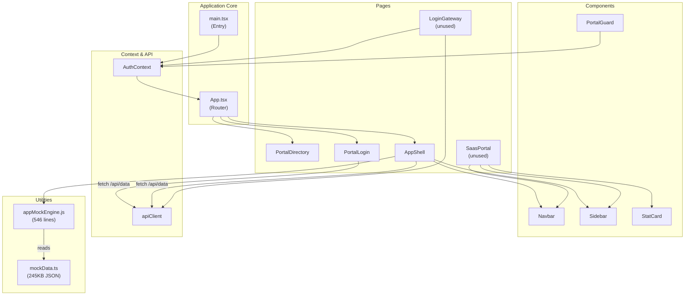

# GRC Wisdom — Dependency Graph (`dependency-graph.md`)

> **Generated**: 2026-07-27 — verified against `package.json` (frontend) and `grc_wisdom_api/package.json` (backend).

---

## 1. Frontend Dependency Graph



---

## 2. Backend Dependency Graph

```mermaid
graph TB
    subgraph "Entry"
        SERVER["server.ts"]
        APPMOD["app.ts"]
    end

    subgraph "Database"
        DB["db.ts"]
        PRISMA["@prisma/client"]
        SCHEMA["schema.prisma<br/>(15 models)"]
        SEED["seed.ts"]
    end

    subgraph "Middleware"
        AUTH["authMiddleware"]
        AUDIT["auditMiddleware"]
        HIER["hierarchyMiddleware"]
        APIKEY["apiKeyMiddleware"]
        I18N["i18nMiddleware"]
        PDPL["pdplScrubber"]
        AIQUOTA["aiQuotaLimiter"]
        VALID["validateRequest"]
    end

    subgraph "Controllers"
        TC["tenantController"]
        DC["documentController"]
        AUC["auditorController"]
        AIC["aiController"]
        SUB["subscriptionController"]
        PLAN["planController"]
        KEYS["apiKeysController"]
        WH["webhooksController"]
    end

    subgraph "Utilities"
        CRYPTO["cryptoUtils"]
        MFA["mfaUtils"]
        LLM["llmUtils"]
        PDPLU["pdplUtils"]
        TREE["treeUtils"]
        ANOM["anomalyDetector"]
        ROLL["rollupUtils"]
        SUMM["summaryGenerator"]
        WHD["webhookDispatcher"]
        ZXML["zatcaXmlBuilder"]
        ZCRY["zatcaCrypto"]
        ZQR["zatcaQrUtils"]
    end

    SERVER --> APPMOD
    APPMOD --> DB --> PRISMA --> SCHEMA

    SEED --> PRISMA

    AUTH -.-> APPMOD
    AUDIT --> CRYPTO
    HIER --> TREE
    PDPL --> AUTH

    DC --> MFA
    DC --> CRYPTO
    AUC --> CRYPTO
    AIC --> LLM
    KEYS -.-> |"crypto (node)"| KEYS
    WH -.-> |"crypto (node)"| WH

    SUMM --> ROLL
    SUMM --> LLM
    WHD -.-> |"crypto (node)"| WHD
    ZCRY -.-> |"crypto (node)"| ZCRY
```



---

## 3. NPM Dependencies

### Frontend (`package.json`)

#### Production Dependencies

| Package | Version | Purpose | Used By |
|---|---|---|---|
| `react` | ^19.1.0 | UI library | All components |
| `react-dom` | ^19.1.0 | DOM rendering | `main.tsx` |
| `react-router-dom` | ^7.6.2 | Client-side routing | `App.tsx`, `PortalLogin.tsx`, `AppShell.tsx` |
| `axios` | ^1.9.0 | HTTP client | `apiClient.ts` |

#### Dev Dependencies

| Package | Version | Purpose |
|---|---|---|
| `vite` | ^6.3.5 | Build tool & dev server |
| `@vitejs/plugin-react` | ^4.4.4 | React fast refresh |
| `typescript` | ~5.8.3 | Type checking |
| `@types/react` | ^19.1.6 | React type definitions |
| `@types/react-dom` | ^19.1.6 | React DOM type definitions |
| `oxlint` | ^0.17.0 | Linter |

### Backend (`grc_wisdom_api/package.json`)

#### Production Dependencies

| Package | Version | Purpose | Used By |
|---|---|---|---|
| `express` | ^4.21.2 | HTTP framework | `app.ts`, `server.ts` |
| `@prisma/client` | ^6.9.0 | ORM client | `db.ts`, `seed.ts`, `app.ts` |
| `prisma-adapter-node-sqlite` | ^6.9.0 | SQLite adapter | `db.ts` |
| `cors` | ^2.8.5 | CORS middleware | `app.ts` |
| `helmet` | ^8.1.0 | Security headers | `app.ts` |
| `jsonwebtoken` | ^9.0.2 | JWT sign/verify | `authMiddleware.ts` |
| `bcryptjs` | ^3.0.2 | Password hashing | `authMiddleware.ts` |
| `zod` | ^3.25.67 | Schema validation | `validateRequest.ts` |
| `otplib` | ^12.0.1 | TOTP generation/verification | `mfaUtils.ts` |
| `qrcode` | ^1.5.4 | QR code generation | `mfaUtils.ts` |

#### Dev Dependencies

| Package | Version | Purpose |
|---|---|---|
| `prisma` | ^6.9.0 | Schema management CLI |
| `typescript` | ^5.8.3 | Type checking |
| `ts-node` | ^10.9.2 | TypeScript execution |
| `@types/express` | ^5.0.1 | Express type definitions |
| `@types/cors` | ^2.8.17 | CORS type definitions |
| `@types/jsonwebtoken` | ^9.0.9 | JWT type definitions |
| `@types/bcryptjs` | ^2.4.6 | bcrypt type definitions |
| `@types/qrcode` | ^1.5.5 | QR code type definitions |

---

## 4. Node Built-in Dependencies

| Module | Used In | Purpose |
|---|---|---|
| `crypto` | `cryptoUtils.ts`, `apiKeysController.ts`, `webhooksController.ts`, `zatcaCrypto.ts`, `pdplUtils.ts`, `webhookDispatcher.ts` | SHA-256, AES-256-GCM, ECDSA, HMAC, random bytes |

---

## 5. Import Dependency Map (File-Level)

### Critical Path: Request → Response

```
server.ts
  └── app.ts
       ├── express, cors, helmet (npm)
       ├── db.ts
       │    └── @prisma/client + prisma-adapter-node-sqlite
       └── (future) routes/*
            ├── authMiddleware.ts
            │    └── jsonwebtoken (npm)
            ├── auditMiddleware.ts
            │    └── cryptoUtils.ts
            │         └── crypto (node)
            ├── hierarchyMiddleware.ts
            │    └── treeUtils.ts
            ├── pdplScrubber.ts
            │    └── authMiddleware.ts (types)
            ├── validateRequest.ts
            │    └── zod (npm)
            └── controllers/*
                 ├── tenantController.ts → (no imports beyond types)
                 ├── documentController.ts → mfaUtils.ts, cryptoUtils.ts
                 │    ├── mfaUtils.ts → otplib, qrcode (npm)
                 │    └── cryptoUtils.ts → crypto (node)
                 ├── auditorController.ts → cryptoUtils.ts
                 ├── aiController.ts → llmUtils.ts
                 ├── subscriptionController.ts → (types only)
                 ├── planController.ts → (no external imports)
                 ├── apiKeysController.ts → crypto (node)
                 └── webhooksController.ts → crypto (node)
```

### Utility Cross-Dependencies

```
summaryGenerator.ts
  ├── rollupUtils.ts (math aggregation)
  └── llmUtils.ts (AI call)

webhookDispatcher.ts
  └── crypto (node built-in)

zatcaXmlBuilder.ts → (no deps, pure string template)
zatcaCrypto.ts → crypto (node built-in)
zatcaQrUtils.ts → (no deps, pure Buffer ops)

pdplUtils.ts → crypto (node built-in)
treeUtils.ts → (no deps, pure string ops)
anomalyDetector.ts → (no deps, pure math)
```

---

## 6. Version Compatibility Notes

| Constraint | Detail |
|---|---|
| **Node.js** | Requires ≥ 18 (for `crypto.subtle` in `appMockEngine.js` and ES module support) |
| **React 19** | Uses new features; react-router-dom v7 required |
| **Prisma 6** | Driver adapter pattern (`prisma-adapter-node-sqlite`) is Prisma 6 specific |
| **TypeScript 5.8** | Strict mode enabled for backend |
| **Vite 6** | Required for `@vitejs/plugin-react` v4 compatibility |
