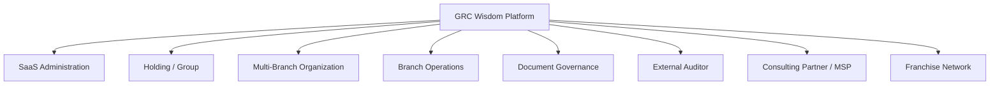

# GRC Wisdom — Platform Analysis

## What is GRC Wisdom?

**GRC Wisdom** is a **multi-tenant SaaS platform for Governance, Risk, and Compliance (GRC)** — built primarily for the Saudi Arabian and Middle Eastern market. It enables organizations to centrally manage their compliance obligations, risk assessments, audit programs, document governance, security posture, and ITSM service delivery.

---

## The Problem It Solves

Organizations — especially banks, hospitals, holding groups, franchises, and consulting firms — face these challenges:

| Problem | How GRC Wisdom Addresses It |
|---|---|
| **Compliance fragmentation** — policies, standards, and audit evidence scattered across spreadsheets and shared drives | Centralized **document lifecycle** with authoring, versioning, approval workflows, e-signatures, retention, and legal hold |
| **No entity isolation** — holding companies with subsidiaries, branches, and franchises can't separate data while maintaining oversight | **Multi-layer tenant isolation** with 5 hierarchy levels (Holding → Subsidiary → BU → Branch → Department) |
| **Role sprawl and privilege abuse** — users get excessive access | **Least-privilege RBAC** with 30+ role profiles, role-based navigation, and segregation of duties |
| **No visibility into security posture** — external attack surface and human risk are blind spots | **Wisdom Eye** (Attack Surface Management) and **Eye Phish** (phishing simulation campaigns) |
| **Audit readiness is manual** — gathering evidence for ISO 27001, SOC 2, Saudi PDPL is painful | **Immutable audit logs** with SHA-256 hashing, cryptographic verification, and external auditor portals |
| **Vendor and partner management gaps** — consulting partners and franchisees operate in silos | **Isolated client workspaces** for partners, franchise governance portals, and workspace transfer workflows |
| **No standardized service management** — support requests aren't tracked with SLAs | Built-in **ITSM Service Desk** with ticket queues, SLA escalations, and knowledge base |

---

## Who Uses It? (8 Operating Models)

The platform supports **8 distinct login portals**, each tailored to a different business model:

| Portal | Example Tenant | Key Personas |
|---|---|---|
| **SaaS Admin** | GRC Wisdom Control Plane | Platform Owner, Security Admin, Billing Admin, Service Desk Manager |
| **Holding Group** | Al Noor Holding Group | Group Admin, Compliance Manager, Risk Manager, HR Manager |
| **Multi-Branch** | OmniOps | Organization Admin, GRC Manager, Support Coordinator |
| **Branch** | Hayat National Hospital — Madinah | Branch Admin, Compliance Officer, Finance User |
| **Document** | Global Bank — Information Security | Document Owner, Compliance Approver, Staff Employee |
| **Auditor** | External Audit | Read-only External Auditor |
| **Partner** | GRC Consulting Partners | Partner Owner, Engagement Manager, Consultant |
| **Franchise** | RetailCo Franchise Network | Franchisor Admin, Franchisee Admin |

---

## Key Modules

### Core GRC
- **Standards & Controls** — Mandated controls, implementations, and evidence collection
- **Risk Management** — Risk registers with consolidated and local views
- **Audit Programme** — Internal/external audit tracking with findings and corrective actions
- **Vendor Management** — Third-party risk and vendor master

### Document Management System (DMS)
- Manual authoring and batch import
- Check-out / check-in with version diffing
- Sequential approval with digital e-signatures (SHA-256)
- Retention schedules, legal hold, and immutable logs

### Security Services
- **Wisdom Eye ASM** — External attack surface monitoring per tenant
- **Eye Phish** — Phishing simulation campaigns (Arabic/English)

### ITSM & Service Management
- Service Desk with ticket queues
- SLA & escalation management
- Service Catalog and Knowledge Base

### Commercial & Billing
- Subscription plans (Essentials → Enterprise Intelligence)
- Invoice management with SAR/USD support
- Payment gateway with ZATCA e-invoicing compliance (Saudi tax)
- Partner tiers and wholesale billing

### Open Source Marketplace
- Curated security tools (Wazuh, OWASP ZAP, Keycloak, Trivy, etc.)
- Tool review & approval workflow
- Per-tenant installations

---

## Architecture Overview

### Frontend (This Repo)
- **React 19 + TypeScript + Vite 8** — SPA with client-side routing
- **Vanilla CSS** — 34KB of custom styles with dark theme
- **Mock Engine** — A massive 245KB [appMockEngine.js](file:///C:/Users/Pablo/Downloads/grc_wisdom_web/src/utils/appMockEngine.js) that renders all dashboard views client-side using `dangerouslySetInnerHTML`
- **Mock Data** — 245KB [mockData.ts](file:///C:/Users/Pablo/Downloads/grc_wisdom_web/src/utils/mockData.ts) containing 156 BRD requirements, 60+ user accounts, seed documents, tickets, invoices, ASM assets, and phishing campaigns

### Backend API (`grc_wisdom_api/`)
- **Express.js + TypeScript** — RESTful API
- **Prisma ORM + SQLite** — Local database with 15+ models
- **Multi-tenant schema** — Tenant hierarchy with materialized path tree (`/GROUP/ORG/BRANCH/`)
- Controllers for: Documents, Tenants, Plans, Subscriptions, Auditor, AI, API Keys, Webhooks

### Database Schema Highlights
- **Immutable Audit Logs** — Hash chain with WORM (Write-Once-Read-Many) enforcement
- **PDPL Compliance** — Encrypted PII fields for Saudi data protection
- **MFA Support** — MFA secret and backup codes on User model
- **ZATCA Integration** — Invoice model with XML, hash, QR, and clearance fields
- **AI/RAG Ready** — DocumentChunk model with vector mock field for future embeddings

---

## Current State

> [!IMPORTANT]
> This is a **working interactive prototype / demo**, not a production application. It uses mock data and client-side rendering to simulate the full platform experience.

- The frontend renders all views through a single mock engine that generates HTML strings
- Authentication is simulated — selecting a demo identity stores a persona ID in localStorage
- The backend API exists but primarily serves mock data via a single `/api/data` endpoint
- The 156 BRD (Business Requirements Document) items track the full product roadmap across 5 phases:
  - **Phase 0**: Commercial Baseline (pricing, plans, billing)
  - **Phase 1**: Trust Foundation (audit trails, security, RBAC, MFA)
  - **Phase 2**: Saudi Usability (Arabic RTL, PDPL, ZATCA)
  - **Phase 3**: Multi-Entity Governance (hierarchy, policy distribution)
  - **Phase 4**: Ecosystem Scale (APIs, webhooks, integrations)
  - **Phase 5**: Intelligence (AI, predictive analytics, RAG)

---

## Summary

**GRC Wisdom is a comprehensive GRC SaaS platform designed for the Middle Eastern enterprise market.** It solves the problem of fragmented governance across complex organizational structures (holdings, franchises, multi-branch, partners) by providing tenant-isolated, role-aware workspaces with built-in document governance, security services, ITSM, and Saudi regulatory compliance (PDPL, ZATCA). The current codebase is an interactive prototype that demonstrates the full vision across 8 operating models with 60+ demo personas.
